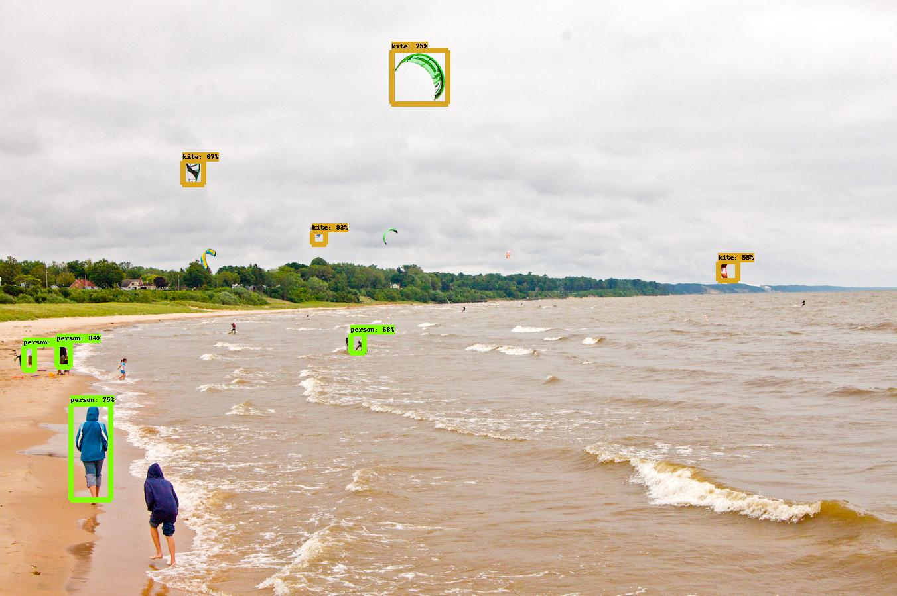

# Tensorflow Object Detection API
Creating accurate machine learning models capable of localizing and identifying
multiple objects in a single image remains a core challenge in computer vision.
The TensorFlow Object Detection API is an open source framework built on top of
TensorFlow that makes it easy to construct, train and deploy object detection
models.  I am currently training this model with Pascal VOC data.
<p align="center">
  
</p>

## References
```
"Speed/accuracy trade-offs for modern convolutional object detectors."
Huang J, Rathod V, Sun C, Zhu M, Korattikara A, Fathi A, Fischer I, Wojna Z,
Song Y, Guadarrama S, Murphy K, CVPR 2017
```
\[[link](https://arxiv.org/abs/1611.10012)\]\[[bibtex](
https://scholar.googleusercontent.com/scholar.bib?q=info:l291WsrB-hQJ:scholar.google.com/&output=citation&scisig=AAGBfm0AAAAAWUIIlnPZ_L9jxvPwcC49kDlELtaeIyU-&scisf=4&ct=citation&cd=-1&hl=en&scfhb=1)\]

## Maintainers

* Jonathan Huang, github: [jch1](https://github.com/jch1)
* Vivek Rathod, github: [tombstone](https://github.com/tombstone)
* Derek Chow, github: [derekjchow](https://github.com/derekjchow)
* Chen Sun, github: [jesu9](https://github.com/jesu9)
* Menglong Zhu, github: [dreamdragon](https://github.com/dreamdragon)


## Table of contents

Before You Start:
* <a href='g3doc/installation.md'>Installation</a><br>

Quick Start:
* <a href='object_detection_tutorial.ipynb'>
      Quick Start: Jupyter notebook for off-the-shelf inference</a><br>
* <a href="g3doc/running_pets.md">Quick Start: Training a pet detector</a><br>

Setup:
* <a href='g3doc/configuring_jobs.md'>
      Configuring an object detection pipeline</a><br>
* <a href='g3doc/preparing_inputs.md'>Preparing inputs</a><br>

Running:
* <a href='g3doc/running_locally.md'>Running locally</a><br>
* <a href='g3doc/running_on_cloud.md'>Running on the cloud</a><br>

Extras:
* <a href='g3doc/detection_model_zoo.md'>Tensorflow detection model zoo</a><br>
* <a href='g3doc/exporting_models.md'>
      Exporting a trained model for inference</a><br>
* <a href='g3doc/defining_your_own_model.md'>
      Defining your own model architecture</a><br>
* <a href='g3doc/using_your_own_dataset.md'>
      Bringing in your own dataset</a><br>


